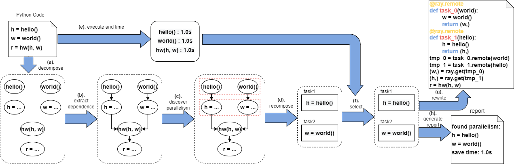

# Overview

The workflow of PyPar on a "helloworld" program is shown as below:

Each step (shown as blue arrow) is implemented as one or multiple classes in `pypar/basics/` directory.

The directory `pypar/utils/` provides high level interfaces.

