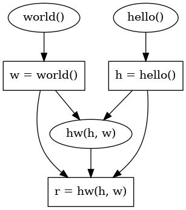

# basics

The directory `pypar/basics/` provides building blocks of the PyPar tool.

## Decompose

`class ExprExtractor` in `pypar/basics/ExprExtractor.py` decompose a statement into fine-grained program units. It takes the AST (abstract syntax tree) of a statement as input, and outputs program units and dependence relations from decomposition.

`ExprExtractor.exprs` is a list that stores the program units (represented by AST nodes).

`ExprExtractor.dependence` is a set that stores the dependence relations from decomposition.

Usage:

```python
import ast
from pypar.basics.utils import getstr

code = '''
h = hello()
w = world()
r = hw(h, w)
'''
stmts = ast.parse(code).body

from pypar.basics.ExprExtractor import ExprExtractor

programUnits = []
dependences = set()

for stmt in stmts:
    ee = ExprExtractor(stmt)
    programUnits += ee.exprs
    dependences |= ee.dependence

print('Program Units:')
for node in programUnits:
    print('    ', getstr(node))

print('Compose Dependence Relation:')
for u, v in dependences:
    print('    %s --> %s' % (getstr(u), getstr(v)))
```

The output:

```
Program Units:
     hello()
     h = hello()
     world()
     w = world()
     hw(h, w)
     r = hw(h, w)
Compose Dependence Relation:
    hw(h, w) --> r = hw(h, w)
    hello() --> h = hello()
    world() --> w = world()
```

## Analyze $Use$ and $Def$

`class ReadWriteAnalyzer` in `pypar/basics/ReadWriteAnalyzer.py` extracts the $Use$ set (denote `Read`) and the $Def$ set (denote `Write`). It takes the AST of target program as input, and outputs the `Read` set and `Write` set. 

`ReadWriteAnalyzer.Read` maps AST node to the set of variables it reads.

`ReadWriteAnalyzer.Write` maps AST node to the set of variables it writes.

Usage:

```python
# copy above code

from pypar.basics.ReadWriteAnalyzer import ReadWriteAnalyzer
rwa = ReadWriteAnalyzer(stmts)

print('Use Set:')
for node, st in rwa.Read.items():
    if node in programUnits:
        print('    ', getstr(node), ':', st)

print('Def Set:')
for node, st in rwa.Write.items():
    if node in programUnits:
        print('    ', getstr(node), ':', st)
```

The output:

```
Use Set:
     hello() : {'hello'}
     h = hello() : {'hello'}
     world() : {'world'}
     w = world() : {'world'}
     hw(h, w) : {'w', 'hw', 'h'}
     r = hw(h, w) : {'w', 'hw', 'h'}
Def Set:
     hello() : set()
     h = hello() : {'h'}
     world() : set()
     w = world() : {'w'}
     hw(h, w) : set()
     r = hw(h, w) : {'r'}
```

## Extract dependence

`class DependenceAnalyzer`  in `pypar/basics/DependenceAnalyzer.py`extracts  data dependence relations (RAW, WAR, WAW) using $Use$ sets and $Def$ sets extracted in the previous step. It takes the AST of target program and $Use, Def$ sets as inputs, and outputs the data dependence relations.

`DependenceAnalyzer` handles two cases separately, which is specified using the `kind` argument. If `kind` is `"sequential"`, the input AST should be a list of program units. If `kind` is `"loop"`, the input AST should be the AST node of target loop statement.

`DependenceAnalyzer.dependence` stores the data dependence relation.

Usage:

```python
# copy above code

from pypar.basics.DependenceAnalyzer import DependenceAnalyzer
da = DependenceAnalyzer(programUnits, rwa.Read, rwa.Write, kind="sequential")
da.dependence |= dependences

print('Data Dependence Relation:')
for u, v in da.dependence:
    print('    %s --> %s' % (getstr(u), getstr(v)))

# DependenceAnalyzer.draw requires pygraphviz
da.draw('output.png')
```

The output:

```python
Data Dependence Relation:
    world() --> w = world()
    hello() --> h = hello()
    h = hello() --> hw(h, w)
    hw(h, w) --> r = hw(h, w)
    h = hello() --> r = hw(h, w)
    w = world() --> hw(h, w)
    w = world() --> r = hw(h, w)
```



## Analyze Time Cost

`class CostAnalyzer`  in `pypar/basics/CostAnalyzer.py`analyses the time cost by each program units, using the time cost by each functions.  The time cost by each function can be obtained using `class TimeTracer` in `pypar/utils/DynamicParallelizer.py`.  `CostAnalyzer.cost` maps AST node to the amount of time it costs.

Usage:

```python
# copy above code

from pypar.basics.CostAnalyzer import CostAnalyzer
funcCost = {
    'hello' : 1.0,
    'world' : 1.0,
    'hw'    : 1.0,
}
ca = CostAnalyzer(programUnits, funcCost=funcCost)

print('Program Units Cost:')
for node, t in ca.cost.items():
    if node in programUnits:
        print('    ', getstr(node), ':', t)
```

Output:

```
Program Units Cost:
     hello() : 1.0
     h = hello() : 1.0
     world() : 1.0
     w = world() : 1.0
     hw(h, w) : 1.0
     r = hw(h, w) : 1.0
```

## Find Parallelism & Dynamic Selection

`class SequenceParallelizer` in `pypar/basics/SequenceParallelizer.py` and `class LoopParallelizer` in `pypar/basics/LoopParallelizer.py` takes program units, dependence relations and time cost as inputs, and outputs discovered parallelisms.

`SequenceParallelizer.parallelizableSets` and `LoopParallelizer.parallelizables` stores parallelizable program units.

Usage:

```python
# copy above code

from pypar.basics.SequenceParallelizer import SequenceParallelizer
sp = SequenceParallelizer(programUnits, da.dependence, ca.cost)

print('Parallelizables:')
for st in sp.parallelizableSets:
    print('-' * 30)
    for node in st:
        print('    ', getstr(node))

```

Output:

```
Parallelizables:
------------------------------
     world()
     hello()
------------------------------
     h = hello()
     w = world()
```

## Recompose & Rewrite

`class {Ray,Thread,Process}SequenceRewriter` in `pypar/basics/SequenceRewriter.py`  and `class {Ray,Thread,Process}LoopRewriter` in `pypar/basics/LoopRewriter.py` rewrite the parallelizable code (either a statement sequence or a loop) using `ray`, `concurrent.futures.ThreadPoolExecutor` or `concurrent.futures.ProcessPoolExecutor`. It takes parallelizables found by corresponding parallelizer as input, recompose parallelizable program units, and outputs parallelized version. `class ParentExtractor` in `pypar/basics/ParentExtractor.py`  collects information that is necessary for rewriting.

Usage:

```python
from pypar.basics.SequenceParallelizer import SequenceParallelizer
sp = SequenceParallelizer(programUnits, da.dependence, ca.cost)

print('Parallelizables:')
for st in sp.parallelizableSets:
    print('-' * 30)
    for node in st:
        print('    ', getstr(node))

from pypar.basics.SequenceRewriter import RaySequenceRewriter
funcDef = ast.FunctionDef(
    'helloworld', 
    ast.arguments(
        posonlyargs=[],
        args=[], 
        vararg=None,
        kwonlyargs=[],
        kw_defaults=[],
        kwarg=None,
        defaults = []),
    stmts,
    [])

from pypar.basics.ParentExtractor import ParentExtractor
pe = ParentExtractor(funcDef)

rewriter = RaySequenceRewriter(funcDef, stmts, sp.stDepthSet, sp.endDepth, sp.parallelizable, rwa.Read, rwa.Write)

print('Code of assistant functions:')
for fDef in rewriter.parallelFuncDefs:
    print('-' * 30)
    print(getstr(fDef))
print()

print('Code of parallelized function:')
print('-' * 30)
print(getstr(rewriter.funcDef))
```

Output:

```
Code of assistant functions:
------------------------------
def helloworld_parallel_func_0(hello):
    h = hello()
    return (h,)
------------------------------
def helloworld_parallel_func_1(world):
    w = world()
    return (w,)

Code of parallelized function:
------------------------------
def helloworld_ray():
    remote_tmp_0 = ray.remote(helloworld_parallel_func_0).remote(hello)
    remote_tmp_1 = ray.remote(helloworld_parallel_func_1).remote(world)
    (h,) = ray.get(remote_tmp_0)
    (w,) = ray.get(remote_tmp_1)
    r = hw(h, w)
```


